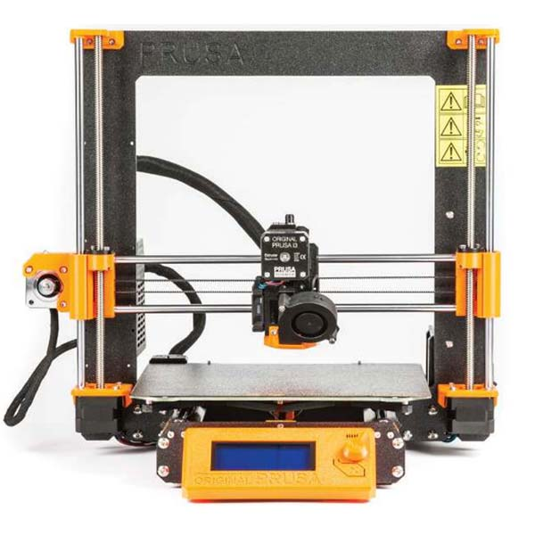
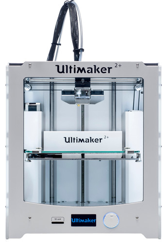
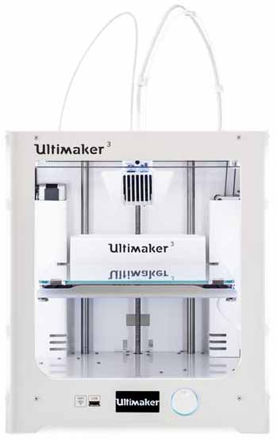
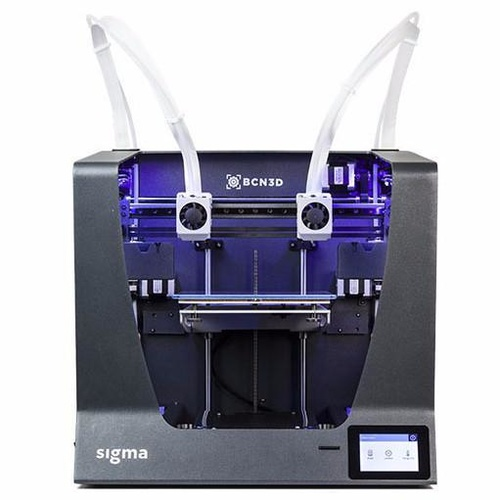
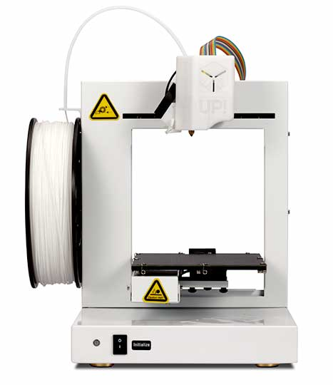

**Al onze 3D printers zijn FFF printers (Fused Filament Fabrication) waarbij we voornamelijk gebruik maken van het biologisch afbreekbare materiaal PLA. Hiermee kunnen er op een goedkope manier snel prototypes gemaakt worden.**

## Prusa i3 MK3

### Specificaties

- Print volume: 250 x 210 x 210 mm
- Slicer software: Slic3r
- Benodigd bestand: .STL of .OBJ
- Laaghoogte vanaf: 0.05 mm
- Mogelijke materialen: PLA, ABS, PET, HIPS, TPU, Nylon, etc

 
 

## Ultimaker 2+

### Specificaties

- Print volume: 223 x 223 x 205 mm
- Slicer software: Cura
- Benodigd bestand: .STL of .OBJ
- Laaghoogte vanaf: 0.05 mm
- Mogelijke materialen: PLA, ABS, CPE

 
 

## Ultimaker 3 

### Specificaties

- Print volume: 215 x 215 x 200 mm 
- Aantal extruders: 2 
- Slicer software: Cura 
- Benodigd bestand: .STL of .OBJ 
- Laaghoogte vanaf: 0.05 mm 
- Mogelijke materialen: PLA, ABS, CPE 

 
 

## BCN3D Sigma

### Specificaties

- Print volume: 210 x 297 x 210 mm
- Aantal extruders: 2
- Slicer software: BCN3D Cura
- Benodigd bestand: .STL of .OBJ
- Laaghoogte vanaf: 0.05 mm
- Mogelijke materialen: PLA, ABS, PVA, TPE, HIPS, etc

## Up Plus 2

### Specificaties

- Print volume: 140 x 140 x 135 mm 
- Slicer software: UP studio 
- Benodigd bestand: .STL of .OBJ 
- Laaghoogte vanaf: 0.15 mm 
- Mogelijke materialen: PLA, ABS 

## 3D Printen bij het Stadslab

Meld je bij de steward voor je aan de slag gaat met de 3D printer.

Je kunt aan de slag met onze 3D printers, met het aanwezige filament (PETG, ABS, PLA, PLA-HT, TPU, PVA). Wil je een filament verwisselen, vraag hier dan de steward bij voor hulp.

De prijs wordt na afloop gebaseerd op het gewicht en type materiaal. In onze prijs zit een kleine marge berekend zodat wij de printers kunnen onderhouden.

3D prints kunnen draaien tijdens de openingstijden (maandag tot en met donderdag zijn we open van 9.00 – 21.00 uur en op vrijdag van 9.00 – 17.00 uur).

Het aanzetten van een 3D print is op eigen risico. De Stadslab medewerkers zullen je helpen om tot een zo goed mogelijk resultaat te komen, maar zij zijn niet verantwoordelijk voor print fails (tenzij mechanische issues).

- PLA/PETG/ABS €0,10 per gram 
- TPU filament €0,20 per gram
- Conductive filament €0,30 per gram 