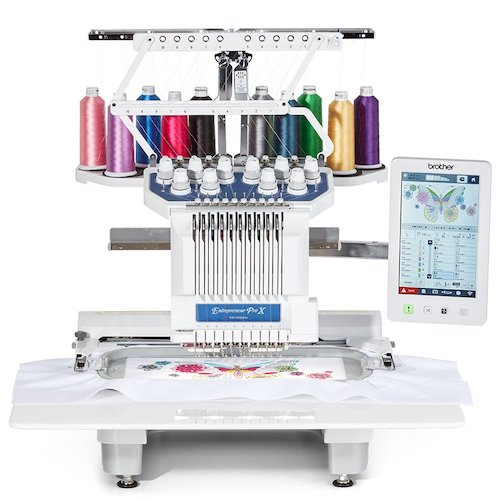
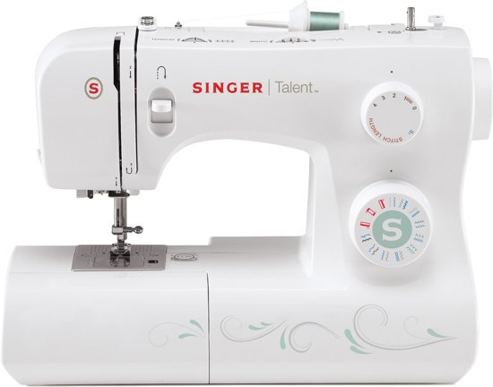
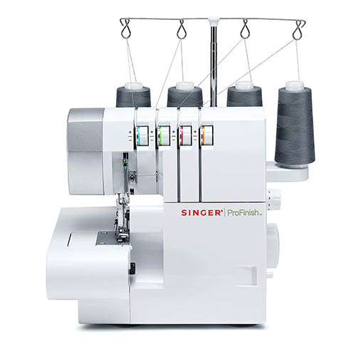
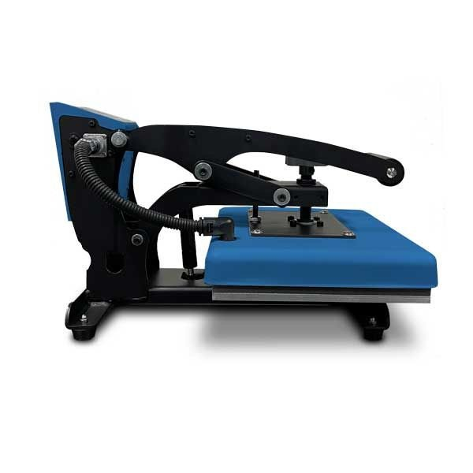

 
 

## Brother PR1055 X 

### Specificaties

- 10 verschillende kleuren draad
- Camera functie waarmee tekeningen gescant kunnen worden om te borduren.

 
 

## Singer Talent 3321 

### Specificaties

- 21 naaiprogramma‘s
- 4-staps knoopsgat
- TopKlick spoeltjes
- Automatische draadinrijger
- Variabele steeklengte en -breedte

 
 

## Singer Overlock 754

### Specificaties

- 6 professionele stekenprogramma‘s
- Differentieel transport
- Wegklapbaar bovenmes
- Eenvoudig verwisselen van naaivoetjes
- Eenvoudig inrijgen
- Steekbreedte instellen
- Steeklengte instellen

 
 

## Calortrans

<!-- ### Specificaties

- 6 professionele stekenprogramma‘s
- Differentieel transport
- Wegklapbaar bovenmes
- Eenvoudig verwisselen van naaivoetjes
- Eenvoudig inrijgen
- Steekbreedte instellen
- Steeklengte instellen -->

