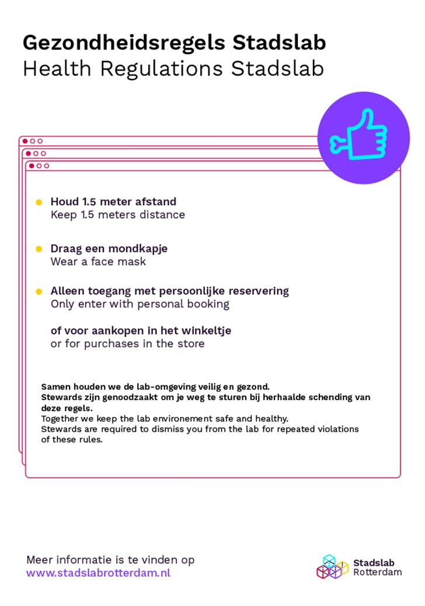

## Update 15-11-2021

Vanwege de huidige maatregelen omtrent Covid-19 is het Stadslab tijdelijk enkel beschikbaar voor onderwijs doeleinden. Gebruik de [bookingstool](https://stadslabrotterdam.nl/booking/) om zeker te zijn van je plek.

---

Je kunt een machine reserveren met onze booking tool! De booking tool is te gebruiken voor onderwijs doeleinden, als je een hobby project wilt maken dan kun je gewoon langs komen en aan de slag als er een machine vrij is. Ook voor de open inloop momenten is de booking tool niet te gebruiken. [https://outlook.office365.com/owa/calendar/Stadslab3@hrnl.onmicrosoft.com/bookings/](https://outlook.office365.com/owa/calendar/Stadslab3@hrnl.onmicrosoft.com/bookings/)

Onze openingstijden voor onderwijs zijn maandag t/m donderdag van 9:00 tot 21:00 uur en vrijdag van 9:00 tot 17:00 uur. De open inloop momenten zijn op dinsdag van 13:00 tot 17:00 uur en op donderdag van 17:00 tot 21:00 uur.

