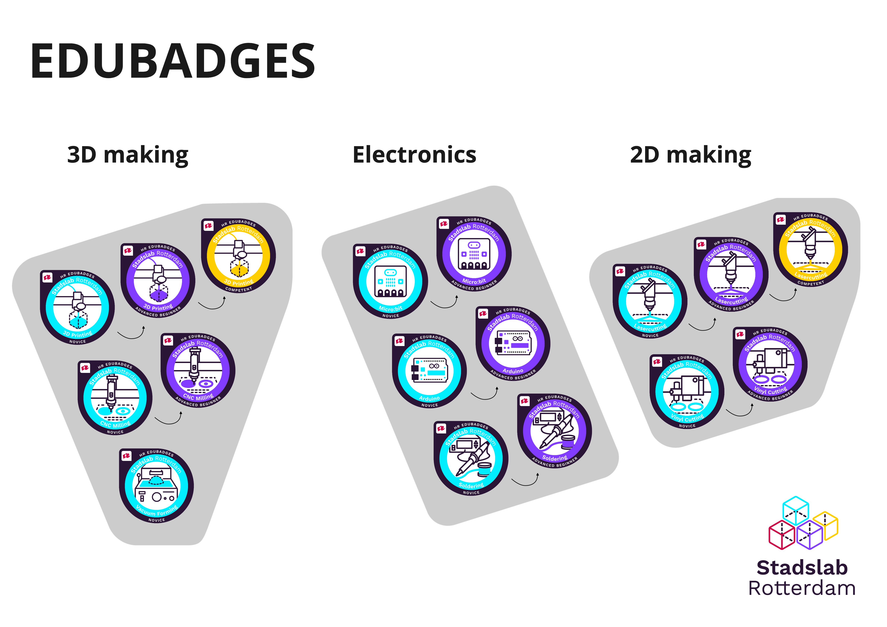

**Badges zijn digitale insignes (afbeeldingen), die aantonen dat de ontvanger over bepaalde kennis of vaardigheden beschikt. Achter de afbeelding bevindt zich zo genoemde meta-data, niet-kopieerbare en niet-aanpasbare digitale informatie over de uitgever en de waarde van de badge. Het zijn dus certificaten waarmee je aantoont een bepaalde vaardigheid of bepaalde kennis te bezitten! De badge kan je ook linken aan je Linkedin pagina en staat mooi in je cv.**

Heb je al een keer een workshop van Stadslab voor een van de 17 badges onderwerpen gevolgd? Lees dan snel verder wat je moet doen om een Edubadge te verdienen! 

### Hoe vraag ik een Edubadge aan? 

1. Volg een (online) workshop bij het Stadslab en/of ga zelfstandig aan de slag in het Stadslab. Op onze [Teams pagina](https://teams.microsoft.com/l/team/19%3ab843d8d32cb24ed09ad94140e7f8f1b6%40thread.skype/conversations?groupId=75694cdb-294d-4615-81ba-45e730612a7d&tenantId=ca6fbace-7cba-4d53-8681-a06284f7ff46) (kanaal Edubadges) kun je een poll invullen welke workshop je zou willen volgen. Op basis van de animo plannen we de workshops in. 

2. Laat een medewerker van het Stadslab je fysieke handelingen beoordelen.  

3. Lever je bewijzen aan via [dit formulier](https://forms.office.com/r/wPZdGfZH2B).  

4. Maak een EduID aan via [www.edubadges.nl](http://www.edubadges.nl/) (gebruik hiervoor niet je school mailadres) en vraag de badge aan via het Edubadge platform. Vind de juiste link voor jouw badge hier [https://edu.nl/edu9y ](https://edu.nl/edu9y)

### Welke Edubadges zijn er allemaal te behalen? 

Bekijk hier het complete aanbod van alle Stadslab Edubadges [https://edu.nl/edu9y](https://edu.nl/edu9y) (iedere badge heeft een eigen aanvraag link).

### Heb je een vraag over Edubadges? 

Navigeer naar het kanaal Edubadges op de Stadslab-Support Teams, als je nog geen toegang hebt kun je de Teams pagina bereiken via deze [link](https://teams.microsoft.com/l/team/19%3ab843d8d32cb24ed09ad94140e7f8f1b6%40thread.skype/conversations?groupId=75694cdb-294d-4615-81ba-45e730612a7d&tenantId=ca6fbace-7cba-4d53-8681-a06284f7ff46). 

Kijk op Edubadges wikipagina met veelgestelde vragen [https://wiki.surfnet.nl/display/edubadges/edubadges](https://wiki.surfnet.nl/display/edubadges/edubadges), met specifieke vragen over de Edubadges van het Stadslab, kun je mailen naar [info@stadslabrotterdam.nl](mailto:info@stadslabrotterdam.nl). 

 
