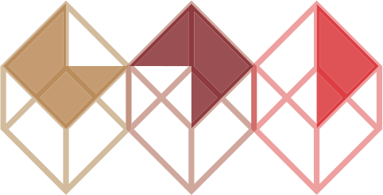
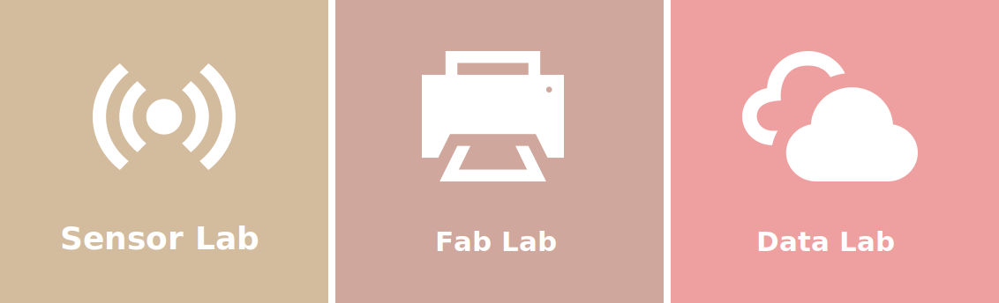
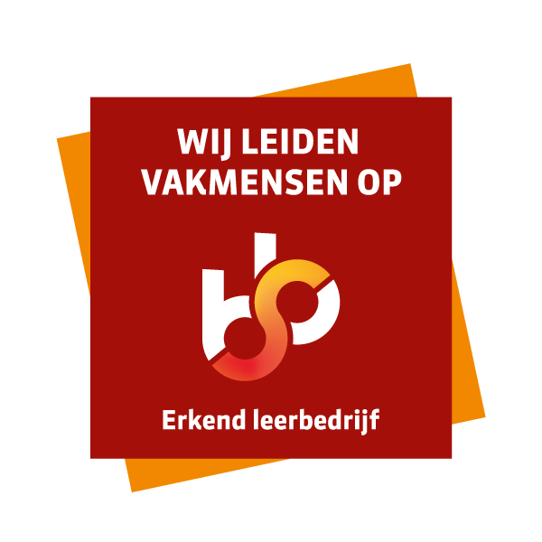

{: .logo}

## Openingstijden tijdens de zomervakantie
De zomervakantie staat voor de deur en dat betekent andere openingstijden! Van 7 t/m 22 juli zijn we open van 9.00 – 17.00 uur. De open inloop is dan op dinsdag en op donderdag van 13:00 – 17:00 uur. Van 25 juli tot en met 19 augustus zijn wij gesloten. Van 22 tot en met 26 augustus zijn we weer open van 9.00 – 17.00 uur. De open inloop is dan op dinsdag en op donderdag van 13:00 – 17:00 uur. Daarna hanteren wij weer onze reguliere openingstijden. 

<iframe width="560" height="315" src="https://www.youtube.com/embed/CCZeAqrFDfk" frameborder="0" allow="accelerometer; autoplay; encrypted-media; gyroscope; picture-in-picture" allowfullscreen></iframe>

## Over Stadslab Rotterdam
Stadslab Rotterdam is de digitale werkplaats van CMI (instituut voor Communicatie, Media en Informatietechnologie van de Hogeschool Rotterdam) waar je allerlei dingen kunt maken. Denk bijvoorbeeld aan apparatuur zoals lasercutters en 3D printers om een prototype of maquette mee te maken. Ook zijn er faciliteiten om aan de slag te gaan met Virtual Reality of Augmented Reality.

Heb je hulp nodig bij het werken met onze toffe machines en apparaten? De stewards van Stadslab Rotterdam helpen je bij het ontwikkelen van jouw project. 



{: .sbb}

