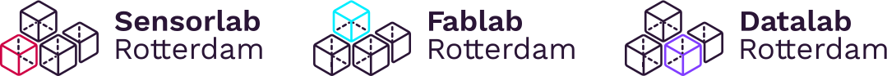

{: .logo}

Beste Maker

Het is zover op donderdag 2 juni, Stadslab Rotterdam bestaat 10 jaar! Een tijd waarin we mooie dingen gemaakt zagen worden, prachtige samenwerkingen zagen ontstaat en nieuwe ontdekkingen deden op het gebied van materiaal, machines, onderwijs en onderzoek. En dat vieren we met jou!

### **Heb je jezelf aangemeld voor de workshops of gesprektafels?** 
Meld je dan bij aankomst aan bij de balie op Wijnhaven 107. Hier ontvang je een badge en verdere instructies zodat je kan aansluiten bij de workshops van jouw keuze. We adviseren je om ruim voor aanvang aan te melden, vanwege het volle programma kan het druk zijn. De ingang bij Wijnhaven 99 is uitsluitend voor workshopleiders. 

Naast de workshops zijn er verschillende doorlopende activiteiten. Bekijk bijvoorbeeld de Expo, loop door de geschiedenis van Stadslab Rotterdam en raak aan de praat met andere makers. Plan je bezoek dus zeker niet te krap. Ga terug in de tijd met een rondleiding in Augmented Reality, waarin we je meenemen in hoe het lab is ontstaan en gegroeid tot wat het nu is. Ten slotte kun je ook nog diverse maakprojecten bekijken in de expo van oud-maaksels!

### **Het programma start om 10.00 uur in de kantine van Wijnhaven 107** 
We starten om 10.00 uur met de opening. Om 10.15 uur begint de eerste workshopronde. Zorg dat je tussen 9.30 en 10.00 uur al binnen en aangemeld bent. Sluit je later aan? Je kan het programma de hele dag door volgen via [https://www.instagram.com/stadslabrotterdam/](www.instagram.com/stadslabrotterdam) 

### **Deel je ervaring op Instagram met #gemaaktinhetStadslab** 
Laat anderen zien wat jij meemaakt tijdens het jubileum. Deel het met #gemaaktinhetStadslab en tag @StadslabRotterdam, en wie weet zie je jezelf terug op ons kanaal. 

### **Hoe zit het met de lunch?**
Heb je jezelf aangemeld voor de community lunch? Dan krijg je van ons een Rotterdamse Kroepia. Bij het registreren ontvang je naast je badge ook een muntje voor deze lunch. Heb je meer trek of bevalt deze lunchkeuze je niet? Dan ben je vrij om gebruik te maken van het aanbod van de cateraar op eigen kosten. Koffie, thee en water verzorgen we de gehele dag voor iedereen kosteloos. 

### **Kun je er toch niet bij zijn?** 
Mocht je onverhoopt niet kunnen komen, meld je dan tijdig af zodat anderen gebruik kunnen maken van jouw plekje. Dat kan via aanmelder: [https://www.aanmelder.nl/stadslabrotterdam/subscribe](aanmelder.nl/stadslabrotterdam/subscribe)

Kom het donderdag 2 juni 2022 (nog een keer) maken in het Stadslab!

### Programma

- **10.00** Feestelijke opening van het jubileum
- **10.15** Workshop ronde 1
- **12.00** Community lunch
- **13.00** Workshop ronde 2
- **14.30** Workshop ronde 3
- **16.00** Workshop ronde 4
- **17.15** Toast en afsluiting

---

Dear Maker

The time has come on June 2, Stadslab Rotterdam exists for 10 years! A time when we saw beautiful things being made, wonderful collaborations and new discoveries in the field of materials, machines, education, and research. And we celebrate this with you!

### **Have you signed up for the workshops or discussion tables?**
Then sign up on arrival at the reception desk at Wijnhaven 107. Here you will receive a badge and further instructions so that you can join the workshops of your choice. We advise you to register well in advance, as it can be very busy due to the full programme. The entrance at Wijnhaven 99 is for workshop leaders only. 

Besides the workshops, there are various ongoing activities. Take a look at the Expo, walk through the history of Stadslab Rotterdam and talk to other makers. So don't plan your visit too short. Go back in time with an Augmented Reality tour, where we take you through how the lab was created and grew into what it is today. Finally, you can also view various making projects in the expo of old makings!

### **The programme starts at 10.00 hrs in the canteen of Wijnhaven 107**
We start at 10.00 with the opening. At 10.15 the first workshop round will start. Make sure you are between 9.30 and 10.00 and register. Are you joining later? You can follow the programme throughout the day at [https://www.instagram.com/stadslabrotterdam/](www.instagram.com/stadslabrotterdam)

### **Share your experience on Instagram with #madeinhetStadslab**
Show others what you experienced during the jubilee. Share it with #madeinhetStadslab and tag @StadslabRotterdam, and who knows, you might see yourself on our channel. 

### **What about the lunch?**
Have you signed up for the community lunch? Then we will give you a Rotterdam Kroepia. When you register, you will receive your badge and a token for this lunch. Are you hungry or don't you like this lunch choice? Then you are free to use the caterer's offer at your own expense. Coffee, tea and water are provided free of charge for everyone throughout the day. 

### **You can't be there?**
If you are unexpectedly unable to attend, please cancel in time so that others can make use of your place. You can do so via: [https://www.aanmelder.nl/stadslabrotterdam/subscribe](aanmelder.nl/stadslabrotterdam/subscribe)

Come and make it (once more) on Thursday 2 June 2022 in the Stadslab!

### Programma

- **10.00** Festive opening
- **10.15** Workshop round 1
- **12.00** Community lunch
- **13.00** Workshop round 2
- **14.30** Workshop round 3
- **16.00** Workshop round 4
- **17.15** Toast and closure

<!--  -->

<!-- ---

<video width="1280" height="720"  autoplay mute loop>
<source src="assets/video/stadslab-10.mp4" type="video/mp4">
</video>

### Stadslab 10 Jaar! Save the date! 16 December!  -->

---

**Stadslab Rotterdam is dé plek om je ideeën vorm te geven. Zit je al een poosje te broeden op een geweldig idee en zou je wel eens willen zien hoe het er in het echt uitziet? Met de aanwezige apparatuur (lasersnijders, 3D printers, vinylsnijder etc) is snel een prototype, maquette of kunstobject gemaakt. En het mooie is, de apparatuur is voor iedereen toegankelijk!**

Stadslab Rotterdam is een fablab, gespecialiseerd in sensortechnologie, (open) data en digitaal prototypen. Het lab is in de eerste plaats een makerspace voor studenten uit een breed scala aan opleidingen maar biedt daarnaast een infrastructuur voor diverse onderwijsvormen. Stadslab Rotterdam bestaat uit een aantal labs, te weten: Sensorlab (meten), Datalab (weten) en Fablab (doen). Daarnaast experimenteren we met een diverse set nieuwe labs: VR-lab (waar studenten experimenteren met de mogelijkheden van VR) en Lab Fygital (waarin retailers leren werken met omnichannel oplossingen).

De kennis die de afgelopen jaar in het lab is ontwikkeld, met name op het gebied van onderwijsontwikkeling, is terug te vinden in het boek ‘Seven Years of Plenty? / Zeven Jaar Rijkdom?’. Kom een gratis exemplaar afhalen in het lab! (Deze publicatie is mede mogelijk gemaakt door Kenniscentrum Creating010)



{: .sbb}

