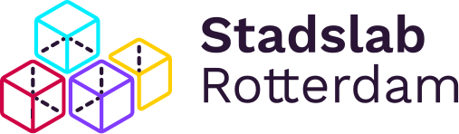

{: .logo}

Het Stadslab bestaat 10 jaar! We blikken vol trots terug op de afgelopen tien jaar waarin er veel is gebeurd. En dat gaan we vieren, op 2 juni 2022, met jou! 
Je kunt je nu inschrijven voor **workshops en gesprekstafels**, maar ook tussendoor zijn er ook diverse activiteiten. Neem bijvoorbeeld deel aan de **community lunch** met een Rotterdamse kroepia, volg een **rondleiding in Augmented Reality** of bezoek de **expo van oud-maaksels**! 

### Programma

- **10.00** Feestelijke opening van het jubileum
- **10.15** Workshop ronde 1
- **12.00** Community lunch
- **13.00** Workshop ronde 2
- **14.30** Workshop ronde 3
- **16.00** Workshop ronde 4
- **17.15** Toast en afsluiting

 **Meld je [hier](https://www.stadslabrotterdam.nl/10jaar) aan voor het Stadslab Jubileum op 2 juni 2022!**

<!-- ---

<video width="1280" height="720"  autoplay mute loop>
<source src="assets/video/stadslab-10.mp4" type="video/mp4">
</video>

### Stadslab 10 Jaar! Save the date! 16 December!  -->

---

**Stadslab Rotterdam is dé plek om je ideeën vorm te geven. Zit je al een poosje te broeden op een geweldig idee en zou je wel eens willen zien hoe het er in het echt uitziet? Met de aanwezige apparatuur (lasersnijders, 3D printers, vinylsnijder etc) is snel een prototype, maquette of kunstobject gemaakt. En het mooie is, de apparatuur is voor iedereen toegankelijk!**

Stadslab Rotterdam is een fablab, gespecialiseerd in sensortechnologie, (open) data en digitaal prototypen. Het lab is in de eerste plaats een makerspace voor studenten uit een breed scala aan opleidingen maar biedt daarnaast een infrastructuur voor diverse onderwijsvormen. Stadslab Rotterdam bestaat uit een aantal labs, te weten: Sensorlab (meten), Datalab (weten) en Fablab (doen). Daarnaast experimenteren we met een diverse set nieuwe labs: VR-lab (waar studenten experimenteren met de mogelijkheden van VR) en Lab Fygital (waarin retailers leren werken met omnichannel oplossingen).

De kennis die de afgelopen jaar in het lab is ontwikkeld, met name op het gebied van onderwijsontwikkeling, is terug te vinden in het boek ‘Seven Years of Plenty? / Zeven Jaar Rijkdom?’. Kom een gratis exemplaar afhalen in het lab! (Deze publicatie is mede mogelijk gemaakt door Kenniscentrum Creating010)



{: .sbb}

